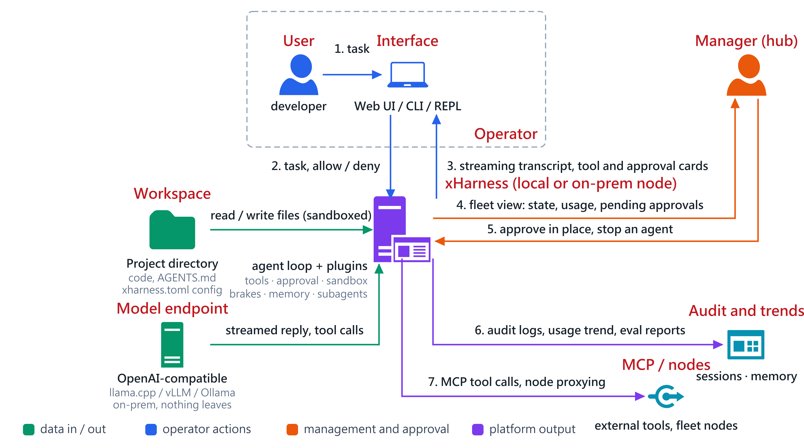
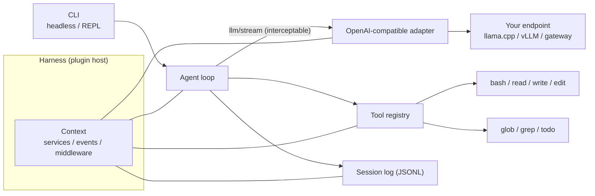

# xHarness

English | [中文](README.md)

[](https://github.com/guessleej/xHarness/actions/workflows/ci.yml)
[](LICENSE)
[](pyproject.toml)

xHarness is a plugin-based AI agent harness by xCloudinfo: governance-first, zero-dependency, "everything is a plugin", a compact Python package that runs against **any OpenAI-compatible endpoint** — llama.cpp (`llama-server`), vLLM, Ollama, LiteLLM, or a company gateway. Fully on-prem friendly: nothing leaves your machine except requests to the model endpoint you configure.

## How it is used



Left to right: the workspace and the model endpoint feed xHarness; an operator gives tasks and answers approvals from the Web UI or CLI (1–3); a manager watches several machines from the fleet hub and approves or stops agents in place (4–5); the platform emits audit logs and usage trends, and reaches external tools or other nodes through MCP (6–7).

## Why

Agent harnesses tend to hard-wire one vendor's API and ship a large dependency tree. xHarness keeps the architecture idea — tools, the model adapter, the session log, and the agent loop wiring are all plugins over a shared context — at a size one person can read in an afternoon: about 1,900 lines of Python, **zero runtime dependencies** (standard library only, including the SSE streaming client, the TOML config reader, and the MCP client), and a test suite that runs in under a second.

## Features

- **Everything is a plugin.** Services, events, and tool registrations are contributed to a shared `Context`; unloading a plugin unwinds everything it registered.
- **Any OpenAI-compatible provider.** Streaming SSE with tool calls, per-request credential resolution from environment variables, configurable temperature and token caps.
- **Built-in tools.** `bash`, `read`, `write`, `edit`, `glob`, `grep`, `todo_write`, plus an opt-in `webfetch`.
- **Sandboxing.** `bash` is confined with OS facilities that are already installed: `sandbox-exec` (Seatbelt) on macOS, `bwrap` (bubblewrap) on Linux — writes are limited to the working directory and temp dirs, `allow_network = false` also cuts the network, and `mode = "require"` refuses to start without a backend.
- **MCP client.** Configure stdio MCP servers under `[mcp.servers.*]`; their tools join the registry as `mcp__{server}__{tool}`. Tools without a `readOnlyHint` are treated as side-effectful and go through the approval policy.
- **Approval policy.** Mutating tools (`bash`, `write`, `edit`, `webfetch`, MCP tools) ask before acting in interactive mode; `--yes` or `approval = "auto"` opts out.
- **Project instructions.** `AGENTS.md` (or `CLAUDE.md`) in the working directory is read into the system prompt automatically, so the agent follows each repo's own conventions; disable with `--no-instructions` or `project_instructions = false`.
- **Cost brakes (telemetry).** An `llm/stream` middleware counts tokens, tool calls, and latency per model call; `max_total_tokens` / `max_llm_calls` hard-stop a runaway task, the usage summary lands in the session log, and `/usage` shows it in the REPL.
- **Eval subsystem.** `xharness eval <dir>` runs a scored suite against any model: each case executes in a clean temp workspace and is graded by deterministic checks (files, answers, command results, whether tools were actually called) plus an optional LLM judge, reporting pass rate, per-case tokens and time, with JSONL output. The bundled `evals/basic` suite quantifies whether a model uses tools and follows instructions.
- **Subagents.** `subagent` delegates one bounded task to a fresh child agent; `subagent_batch` fans independent tasks out in parallel. Children share tools and model, cannot spawn children, and route every side effect through the parent's approval policy.
- **Web UI and fleet view.** `xharness web` serves a local interface: streaming transcript, tool cards, approval buttons, conversation, session, and memory lists, usage chips, light/dark theme. The fleet view shows every conversation and subagent on one page — state, usage, pending approvals — with inline approve/deny and a **stop** button per agent. Binds 127.0.0.1 by default; binding elsewhere requires `--token`.
- **Telegram channel.** Mount `[channels.telegram]` on a node and drive it from your phone: every chat is an ordinary conversation (visible in the fleet view, same approval policy and budget brake, same session log), and mutating tools arrive as allow / deny buttons; `POST /api/notify` lets the platform, a scheduler or any other system push a notification to your Telegram. Only chats listed in `allowed_chats` are served, everything else is ignored; the bot token is read from a file (`token_file`) or an env var, never from the config itself.
- **Multi-node fleet.** Every machine runs its own `xharness web` as a node; any machine whose config lists the nodes becomes a hub: its fleet view merges local and remote conversations, and approve / deny / stop are proxied through the hub. Node tokens live only in the hub's environment; the browser never sees them. `xharness fleet` prints the whole fleet in the terminal.
- **Usage history.** Session logs on disk are the source of truth (telemetry lands at the end of every task, covering CLI, headless, Web, and subagents); `xharness usage` aggregates tokens, model calls, and tool calls by hour or day, and the fleet view draws a trend line per node (one y axis, one fixed hue per node, crosshair tooltip, legend, table view), with the hub pulling each node's own history onto a shared time axis.
- **Provider catalog presets.** `preset = "ollama"` wires up llama.cpp, Ollama, vLLM, LM Studio, LiteLLM, or OpenAI, OpenRouter, Groq, Mistral, Together in one line; `xharness providers probe` checks each endpoint and lists the models it serves.
- **Memory layer.** Persistent memory across sessions: one Markdown file per fact under `~/.xharness/memory/` with a generated `MEMORY.md` index. The model sees the index (names and one-line descriptions) on every call and loads a memory in full only when it asks; `memory_write`/`memory_delete` go through approval and every change is recorded in `audit.jsonl` with the agent and session. `xharness memory` shows a human exactly what the agent remembers. Memories are grouped by **topic** with generated `topics/<topic>.md` pages; `xharness memory consolidate` finds duplicate, contradictory, or stale memories and proposes a merge plan — dry-run by default, `--apply` executes, `--llm` lets the model propose. Memories not confirmed or used for a long time are flagged **待確認** (stale, `stale_days`, default 90) for both the model and humans; `xharness memory verify` re-verifies them (optionally with the model, using newer memories in the same topic as evidence) and `memory expire` **archives** rather than deletes what is truly expired.
- **Append-only session log.** Every message and tool result is recorded as JSONL under `~/.xharness/sessions/`; `--resume <id>` continues a session.
- **Two run modes.** Headless one-shot (`xharness "task"`) and an interactive REPL.
- **Extensible.** User plugin modules add tools and services from config; `llm/stream` middleware intercepts every model call for caching, logging, or routing.
- **No telemetry.** xHarness sends nothing anywhere except your configured model endpoint (and the `webfetch` tool or MCP servers you enable yourself). There is no anonymous id, no usage upload, no phone-home of any kind.

## Quickstart

Requires Python 3.11 or newer.

```sh
git clone https://github.com/guessleej/xHarness.git
cd xHarness
python3 -m venv .venv && ./.venv/bin/pip install -e .
```

Point it at any OpenAI-compatible endpoint. The fastest way is environment variables:

```sh
export XHARNESS_BASE_URL=http://localhost:8080/v1
export XHARNESS_MODEL=your-model-id
./.venv/bin/xharness "list the files in this directory and summarize the project"
```

Or copy `xharness.example.toml` (Chinese-commented version: `xharness.example.zh.toml`) to `xharness.toml` and edit it:

```toml
default_provider = "local"
approval = "prompt"

[providers.local]
base_url = "http://localhost:8080/v1"
model = "your-model-id"
# api_key_env = "XHARNESS_API_KEY"
```

Then:

```sh
xharness              # interactive REPL
xharness "task"       # headless one-shot
xharness sessions     # list saved sessions
xharness --resume 2026-08-22-ab12cd34   # continue a session
```

## Built-in tools

| Tool | Mutating | Purpose |
|---|---|---|
| `bash` | yes | Run a shell command; output capped, timeout bounded |
| `read` | no | Read a file with numbered lines, offset/limit for large files |
| `write` | yes | Write a file, creating parent directories |
| `edit` | yes | Exact-string replacement; ambiguous matches are refused |
| `glob` | no | Find files by glob pattern (`**`, `*`, `?`) |
| `grep` | no | Search file contents by regular expression |
| `todo_write` | no | Maintain a working todo list for multi-step tasks |
| `subagent` | yes | Delegate a task to a fresh child agent and return its answer |
| `subagent_batch` | yes | Run independent tasks in parallel children, one heading per task |
| `memory_write` | yes | Save a cross-session memory (name, one-line description, content) |
| `memory_read` / `memory_search` / `memory_list` | no | Read in full / keyword search / list the index |
| `memory_delete` | yes | Remove a wrong or obsolete memory |
| `memory_verify` | yes | Confirm a stale memory is still true; resets its verification date |
| `memory_consolidate` | yes | Tidy one topic: find duplicates / contradictions / stale entries and merge; without `apply` it only returns the plan |
| `security_scan` | no | Run bandit / pip-audit / gitleaks against a directory (missing scanners are skipped) |
| `webfetch` | yes | Fetch an http(s) URL as readable text; **disabled by default** (`[tools] webfetch = true`) — enabling it is the only egress besides the model endpoint, and every fetch goes through approval |

Approval applies to mutating tools only. In headless mode the default is `auto` (nobody is watching a pipe); in interactive mode the default is `prompt`. An explicit `--approve prompt|auto` always wins.

## Sandbox

Commands from the `bash` tool run confined when a backend is detected (`sandbox-exec` on macOS, `bwrap` on Linux): the filesystem is read-only except the working directory and temp dirs. The REPL banner shows the active sandbox.

```toml
[sandbox]
mode = "auto"          # auto (default) | require (refuse to start without a backend) | off
allow_network = true   # false also cuts the network inside bash commands
```

`auto` falls back to bare execution where no backend exists (say, a container without bwrap) — use `require` to make confinement a hard guarantee.

## MCP servers

Any stdio MCP server can contribute tools:

```toml
[mcp.servers.fs]
command = "npx"
args = ["-y", "@modelcontextprotocol/server-filesystem", "/data"]
# env = { KEY = "value" }
# timeout_seconds = 60
```

Tools appear in `/tools` as `mcp__fs__read_file` and the like. MCP tools without a declared `readOnlyHint` are treated as side-effectful and gated by the approval policy; a server that fails to start is skipped with a warning instead of taking the harness down.

## Web UI and fleet view

```sh
xharness web                          # http://127.0.0.1:3080, opens a browser
xharness web --port 8090 --no-open
xharness web --host 0.0.0.0 --token <long-random-string>   # non-loopback binding requires a token
```

The UI is one zero-dependency page: a glass top bar with model, usage, and status; a live streaming transcript with tool calls folded into cards; approval cards with allow/deny for side effects (`-y` makes it fully automatic); a slide-over listing running conversations, on-disk sessions (resumable), and current memories. The composer guards against IME Enter (no accidental sends mid-composition).

**Fleet view** (top bar, "艦隊"): one card per conversation — state (running / waiting for approval / idle), task preview, tokens, calls, tool count, elapsed seconds, active subagents — under a row of totals. Pending approvals can be allowed or denied right on the card, and any running agent can be stopped: it halts before its next model call and pending approvals are denied (an in-flight model request cannot be interrupted; the loop exits when it returns).

Security: loopback by default, non-loopback `Host` headers rejected (DNS rebinding), every POST needs a custom header (cross-site form posts), tokens only in `Authorization`, SSE authenticated with 60-second single-use tickets. Details in [docs/ssdlc.md](docs/ssdlc.md).

## Subagents

The model can delegate sub-problems so their details do not flood its own context:

```toml
[subagent]
max_workers = 4   # parallelism for subagent_batch
max_turns = 20    # per-child turn limit
```

Children share tools, model, telemetry, and the session log (events tagged with the `agent` name; `--resume` rebuilds only the main line). Children cannot see the `subagent` tools, so there is no unbounded recursion, and every side effect goes through the parent's approval policy — a `prompt`-mode parent still asks you.

## Multi-node fleet

On each node (a machine you want to watch) — non-loopback binding requires a token, which need not appear on the command line:

```sh
XHARNESS_WEB_TOKEN_FILE=/run/secrets/xharness-node xharness web --host 0.0.0.0 --port 3080 --no-open
```

On the hub (any machine) — list the nodes in `xharness.toml`, referencing tokens by environment variable name:

```toml
[fleet]
name = "hub-office"                 # this machine's label in the fleet view (default: hostname)

[fleet.nodes.farm]
url = "http://10.0.0.5:3080"
token_file = "~/.xharness/node-tokens/farm"   # a 0600 file; or token_env = "XHARNESS_NODE_FARM_TOKEN"
# timeout_seconds = 3
```

```sh
xharness fleet                      # terminal: per node up/DOWN, latency, conversations, running, waiting, tokens
xharness web                        # the fleet view gains a "節點: farm" section; cards approve / deny / stop in place
```

Trust model: the hub forwards exactly two actions (approvals, stop) on an allow-list with validated conversation ids; a node answering a hub does not poll its own nodes (no recursion); "open on node" opens that node's own UI, which has its own authentication. Plain http is acceptable inside a LAN; put a TLS reverse proxy in front of nodes across network boundaries.

## Usage history

```sh
xharness usage                       # last 7 days by day: tokens, model calls, tool calls, tasks
xharness usage --since 24h           # last 24 hours by hour
xharness usage --since 30d --nodes   # plus every configured fleet node
```

The source is the `telemetry` events in `~/.xharness/sessions/*.jsonl` (the cumulative usage the telemetry plugin writes at the end of each task); consecutive entries within a session are differenced into per-task usage, so no web server needs to be running and headless and subagent traffic count too. `GET /api/usage?since=7d` returns local history, `GET /api/fleet/usage` is the hub's merge of every node; the fleet view's "用量趨勢" section switches 24h / 7d / 30d and chart / table. Eval cases run on throwaway harnesses without sessions and are not counted.

## Provider catalog presets

```toml
[providers.local]
preset = "ollama"          # fills defaults only: base_url and api_key_env; the model is always yours
model = "your-model"

[providers.cloud]
preset = "groq"            # hosted presets send prompts off-machine; opt-in by nature
model = "llama-3.3-70b-versatile"
# explicit base_url / api_key_env override the preset
```

```sh
xharness providers presets   # built-in presets (local / hosted, base_url, key env var)
xharness providers probe     # GET /models on every configured provider, list what it serves
xharness providers probe cloud
```

Built in: `llama-cpp`, `ollama`, `vllm`, `lmstudio`, `litellm` (local); `openai`, `openrouter`, `groq`, `mistral`, `together` (hosted).

## Memory

Memory is for humans to read: `~/.xharness/memory/<name>.md`, one fact per file with a small front matter (name, description, kind, updated) followed by the body; `MEMORY.md` is a generated index. The model sees the index in its system prompt on every call (size-capped; overflow says "use memory_search") and only loads a memory in full when it calls `memory_read` — memory never silently floods the context.

```sh
xharness memory                 # the index: what the agent remembers, grouped by topic
xharness memory topics          # topics and their memories
xharness memory show fav-editor # one memory in full
xharness memory search deploy   # keyword search
xharness memory audit           # who wrote, deleted, or consolidated what, in which session
xharness memory consolidate ops          # merge plan for topic ops (dry run)
xharness memory consolidate ops --llm    # plus model proposals (duplicates, contradictions, stale)
xharness memory consolidate all --apply  # execute the plans for every topic
xharness memory stale                    # memories not confirmed or used for a long time
xharness memory verify deploy-target     # a human confirms one is still true
xharness memory verify ops --llm         # the model judges stale ones against newer memories (dry run)
xharness memory verify all --llm --apply # apply only "verify" verdicts; contradictions are never auto-deleted
xharness memory expire --apply           # archive memories older than expire_days into memory/archive/
```

### Expiry and re-verification

A memory's freshness is the latest of `verified`, `updated`, and its last `memory_read`. Past `stale_days` it is **stale**: flagged in the index, in `MEMORY.md`, and in the Web panel, and the system prompt tells the model to treat it with caution and call `memory_verify` once confirmed. Three ways to re-verify: by hand (`verify <name>`); model-assisted (`verify <topic> --llm`), which uses only **newer** memories of the same topic as evidence and returns `verify` / `contradicted` / `unknown` — `--apply` acts only on `verify`, contradictions are listed for a human; and past `expire_days` (off by default) `expire --apply` archives them, **never deletes**, audited as `expire`.

### Topics and consolidation

Every memory has a `topic` (default: its `kind`). `MEMORY.md` is sectioned by topic and `topics/<topic>.md` are generated pages that concatenate a topic's memories in full, so a person reads one subject in one place instead of opening a dozen files.

Consolidation has two layers: a **deterministic** one finds near-duplicate memories by text similarity and folds them into the newer (on a tie, fuller) one; a **model** layer (`--llm`, or the tool's `use_model`) reads the whole topic and proposes merges and deletions with reasons, but may only reference names that exist in the topic — anything else is dropped. A plan is always shown before it runs: the CLI is dry-run by default, the agent's `memory_consolidate` returns the plan unless `apply` is set and then goes through approval; every merge and delete is audited as `consolidate`.

```toml
[memory]
# enabled = true
# dir = "/path/to/memory"    # default ~/.xharness/memory; point it at a project for project memory
# max_index_chars = 6000
# stale_days = 90             # days without confirmation or use before a memory is flagged stale
# expire_days = 0             # days before it may be archived (0 = off)
```

Governance: writes and deletes are mutating tools (interactive mode asks you); every change is audited with the agent name and session; memory is model-written content that feeds future prompts, so like `AGENTS.md` it is a trust decision — review `xharness memory audit` periodically and `memory_delete` (or delete the file) when something is wrong. The Web UI side panel lists current memories.

## Evaluating models (eval)

```sh
xharness eval evals/basic                       # bundled: write, edit, search, bash, multi-step, instruction following
xharness eval evals/basic --repeat 3 --json out.jsonl
xharness eval my-cases/ --model other-model      # same suite, different model
```

A case is one TOML file: `prompt` gives the task, `[setup]` pre-creates files, `[[checks]]` score it; every check must pass:

```toml
prompt = "Change port = 8080 to 9090 in config.ini; touch nothing else."
max_turns = 8

[setup]
"config.ini" = "[server]\nport = 8080\nworkers = 4\n"

[[checks]]
kind = "file_contains"
path = "config.ini"
pattern = "port = 9090"

[[checks]]
kind = "file_contains"
path = "config.ini"
pattern = "port = 8080"
absent = true
```

Check kinds: `answer_contains`, `answer_regex`, `file_exists`, `file_contains`, `command` (runs in the workspace, exit 0 passes), `tool_called` (did the model really call a tool), `judge` (the same model grades PASS/FAIL against a `rubric`). Any check takes `absent = true` to invert. Each case gets a fresh harness, so tokens and time are per case; `--repeat N` measures stability.

## Writing a plugin

A plugin is a Python file exposing a module-level `plugin`:

```python
# plugins/word_count.py
from xharness import Plugin, Tool, ToolResult, register_tools

def _apply(ctx, config):
    tool = Tool(
        name="word_count",
        description="Count words in a string.",
        parameters={
            "type": "object",
            "properties": {"text": {"type": "string"}},
            "required": ["text"],
        },
        execute=lambda args, tool_ctx: ToolResult(str(len(str(args["text"]).split()))),
    )
    register_tools(ctx, [tool])

plugin = Plugin("word-count", _apply)
```

Mount it from `xharness.toml`:

```toml
[[plugins]]
id = "word-count"
module = "./plugins/word_count.py"
```

Middleware wraps every model call through the `llm/stream` seam:

```python
def _apply(ctx, config):
    def logger(payload, next_call):
        print(f"[llm] {len(payload['messages'])} messages, {len(payload['tools'])} tools")
        return next_call(payload)
    ctx.intercept("llm/stream", logger)

plugin = Plugin("call-logger", _apply)
```

Embedding in your own program uses the same pieces:

```python
from xharness import Agent, AgentOptions, build_harness, load_config

harness = build_harness(load_config(), no_session=True)
agent = Agent(harness.ctx, AgentOptions(approval_mode="auto"))
answer = agent.run("what does pyproject.toml declare as the test dependency?")
```

## Architecture



Design notes, seams, and a comparison with larger harnesses are in [docs/architecture.md](docs/architecture.md).

## Development

```sh
python3 -m venv .venv && ./.venv/bin/pip install -e ".[dev]"
./.venv/bin/python -m pytest -q
```

## Versioning

Current release: **1.0** (2026-09-19). 1.x carries compatible additions and fixes only; breaking changes wait for 2.0 and are recorded in [CHANGELOG.md](CHANGELOG.md).

## Security

Threat model, life-cycle controls, and the CI security gates are in [docs/ssdlc.md](docs/ssdlc.md); vulnerability reporting is in [SECURITY.md](SECURITY.md).

## License

[MIT](LICENSE) — copyright xCloudinfo Corp. Limited.
