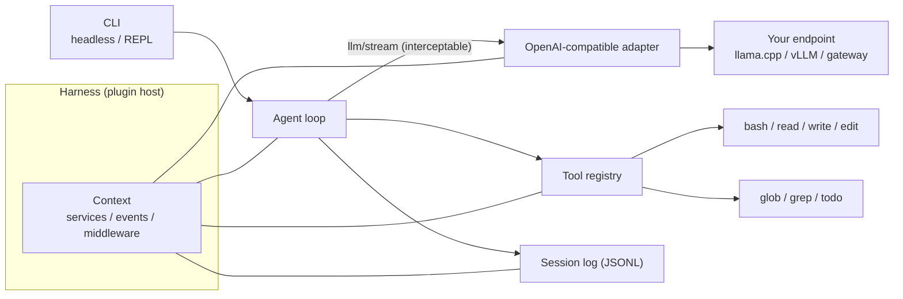

# xHarness

English | [中文](README.md)

[](https://github.com/guessleej/xHarness/actions/workflows/ci.yml)
[](LICENSE)
[](pyproject.toml)

xHarness is a plugin-based AI agent harness by xCloudinfo. It is inspired by the "everything is a plugin" architecture of [DeepSeek Harness](https://github.com/deepseek-ai/deepseek-harness), rebuilt as a compact Python package that runs against **any OpenAI-compatible endpoint** — llama.cpp (`llama-server`), vLLM, Ollama, LiteLLM, or a company gateway. Fully on-prem friendly: nothing leaves your machine except requests to the model endpoint you configure.

## Why

Agent harnesses tend to hard-wire one vendor's API and ship a large dependency tree. xHarness keeps the architecture idea — tools, the model adapter, the session log, and the agent loop wiring are all plugins over a shared context — at a size one person can read in an afternoon: about 1,900 lines of Python, **zero runtime dependencies** (standard library only, including the SSE streaming client, the TOML config reader, and the MCP client), and a test suite that runs in under a second.

## Features

- **Everything is a plugin.** Services, events, and tool registrations are contributed to a shared `Context`; unloading a plugin unwinds everything it registered.
- **Any OpenAI-compatible provider.** Streaming SSE with tool calls, per-request credential resolution from environment variables, configurable temperature and token caps.
- **Built-in tools.** `bash`, `read`, `write`, `edit`, `glob`, `grep`, `todo_write`, plus an opt-in `webfetch`.
- **Sandboxing.** `bash` is confined with OS facilities that are already installed: `sandbox-exec` (Seatbelt) on macOS, `bwrap` (bubblewrap) on Linux — writes are limited to the working directory and temp dirs, `allow_network = false` also cuts the network, and `mode = "require"` refuses to start without a backend.
- **MCP client.** Configure stdio MCP servers under `[mcp.servers.*]`; their tools join the registry as `mcp__{server}__{tool}`. Tools without a `readOnlyHint` are treated as side-effectful and go through the approval policy.
- **Approval policy.** Mutating tools (`bash`, `write`, `edit`, `webfetch`, MCP tools) ask before acting in interactive mode; `--yes` or `approval = "auto"` opts out.
- **Project instructions.** `AGENTS.md` (or `CLAUDE.md`) in the working directory is read into the system prompt automatically, so the agent follows each repo's own conventions; disable with `--no-instructions` or `project_instructions = false`.
- **Cost brakes (telemetry).** An `llm/stream` middleware counts tokens, tool calls, and latency per model call; `max_total_tokens` / `max_llm_calls` hard-stop a runaway task, the usage summary lands in the session log, and `/usage` shows it in the REPL.
- **Eval subsystem.** `xharness eval <dir>` runs a scored suite against any model: each case executes in a clean temp workspace and is graded by deterministic checks (files, answers, command results, whether tools were actually called) plus an optional LLM judge, reporting pass rate, per-case tokens and time, with JSONL output. The bundled `evals/basic` suite quantifies whether a model uses tools and follows instructions.
- **Subagents.** `subagent` delegates one bounded task to a fresh child agent; `subagent_batch` fans independent tasks out in parallel. Children share tools and model, cannot spawn children, and route every side effect through the parent's approval policy.
- **Web UI.** `xharness web` serves a local interface: streaming transcript, tool cards, approval buttons, conversation and session lists, usage chips, light/dark theme. Binds 127.0.0.1 by default; binding elsewhere requires `--token`.
- **Append-only session log.** Every message and tool result is recorded as JSONL under `~/.xharness/sessions/`; `--resume <id>` continues a session.
- **Two run modes.** Headless one-shot (`xharness "task"`) and an interactive REPL.
- **Extensible.** User plugin modules add tools and services from config; `llm/stream` middleware intercepts every model call for caching, logging, or routing.
- **No telemetry.** xHarness sends nothing anywhere except your configured model endpoint (and the `webfetch` tool or MCP servers you enable yourself). There is no anonymous id, no usage upload, no phone-home of any kind.

## Quickstart

Requires Python 3.11 or newer.

```sh
git clone https://github.com/guessleej/xHarness.git
cd xHarness
python3 -m venv .venv && ./.venv/bin/pip install -e .
```

Point it at any OpenAI-compatible endpoint. The fastest way is environment variables:

```sh
export XHARNESS_BASE_URL=http://localhost:8080/v1
export XHARNESS_MODEL=your-model-id
./.venv/bin/xharness "list the files in this directory and summarize the project"
```

Or copy `xharness.example.toml` (Chinese-commented version: `xharness.example.zh.toml`) to `xharness.toml` and edit it:

```toml
default_provider = "local"
approval = "prompt"

[providers.local]
base_url = "http://localhost:8080/v1"
model = "your-model-id"
# api_key_env = "XHARNESS_API_KEY"
```

Then:

```sh
xharness              # interactive REPL
xharness "task"       # headless one-shot
xharness sessions     # list saved sessions
xharness --resume 2026-08-22-ab12cd34   # continue a session
```

## Built-in tools

| Tool | Mutating | Purpose |
|---|---|---|
| `bash` | yes | Run a shell command; output capped, timeout bounded |
| `read` | no | Read a file with numbered lines, offset/limit for large files |
| `write` | yes | Write a file, creating parent directories |
| `edit` | yes | Exact-string replacement; ambiguous matches are refused |
| `glob` | no | Find files by glob pattern (`**`, `*`, `?`) |
| `grep` | no | Search file contents by regular expression |
| `todo_write` | no | Maintain a working todo list for multi-step tasks |
| `subagent` | yes | Delegate a task to a fresh child agent and return its answer |
| `subagent_batch` | yes | Run independent tasks in parallel children, one heading per task |
| `security_scan` | no | Run bandit / pip-audit / gitleaks against a directory (missing scanners are skipped) |
| `webfetch` | yes | Fetch an http(s) URL as readable text; **disabled by default** (`[tools] webfetch = true`) — enabling it is the only egress besides the model endpoint, and every fetch goes through approval |

Approval applies to mutating tools only. In headless mode the default is `auto` (nobody is watching a pipe); in interactive mode the default is `prompt`. An explicit `--approve prompt|auto` always wins.

## Sandbox

Commands from the `bash` tool run confined when a backend is detected (`sandbox-exec` on macOS, `bwrap` on Linux): the filesystem is read-only except the working directory and temp dirs. The REPL banner shows the active sandbox.

```toml
[sandbox]
mode = "auto"          # auto (default) | require (refuse to start without a backend) | off
allow_network = true   # false also cuts the network inside bash commands
```

`auto` falls back to bare execution where no backend exists (say, a container without bwrap) — use `require` to make confinement a hard guarantee.

## MCP servers

Any stdio MCP server can contribute tools:

```toml
[mcp.servers.fs]
command = "npx"
args = ["-y", "@modelcontextprotocol/server-filesystem", "/data"]
# env = { KEY = "value" }
# timeout_seconds = 60
```

Tools appear in `/tools` as `mcp__fs__read_file` and the like. MCP tools without a declared `readOnlyHint` are treated as side-effectful and gated by the approval policy; a server that fails to start is skipped with a warning instead of taking the harness down.

## Web UI

```sh
xharness web                          # http://127.0.0.1:3080, opens a browser
xharness web --port 8090 --no-open
xharness web --host 0.0.0.0 --token <long-random-string>   # non-loopback binding requires a token
```

The UI is one zero-dependency page: a glass top bar with model, usage, and status; a live streaming transcript with tool calls folded into cards; approval cards with allow/deny for side effects (`-y` makes it fully automatic); a slide-over listing running conversations and on-disk sessions (resumable). The composer guards against IME Enter (no accidental sends mid-composition).

Security: loopback by default, non-loopback `Host` headers rejected (DNS rebinding), every POST needs a custom header (cross-site form posts), tokens only in `Authorization`, SSE authenticated with 60-second single-use tickets. Details in [docs/ssdlc.md](docs/ssdlc.md).

## Subagents

The model can delegate sub-problems so their details do not flood its own context:

```toml
[subagent]
max_workers = 4   # parallelism for subagent_batch
max_turns = 20    # per-child turn limit
```

Children share tools, model, telemetry, and the session log (events tagged with the `agent` name; `--resume` rebuilds only the main line). Children cannot see the `subagent` tools, so there is no unbounded recursion, and every side effect goes through the parent's approval policy — a `prompt`-mode parent still asks you.

## Evaluating models (eval)

```sh
xharness eval evals/basic                       # bundled: write, edit, search, bash, multi-step, instruction following
xharness eval evals/basic --repeat 3 --json out.jsonl
xharness eval my-cases/ --model other-model      # same suite, different model
```

A case is one TOML file: `prompt` gives the task, `[setup]` pre-creates files, `[[checks]]` score it; every check must pass:

```toml
prompt = "Change port = 8080 to 9090 in config.ini; touch nothing else."
max_turns = 8

[setup]
"config.ini" = "[server]\nport = 8080\nworkers = 4\n"

[[checks]]
kind = "file_contains"
path = "config.ini"
pattern = "port = 9090"

[[checks]]
kind = "file_contains"
path = "config.ini"
pattern = "port = 8080"
absent = true
```

Check kinds: `answer_contains`, `answer_regex`, `file_exists`, `file_contains`, `command` (runs in the workspace, exit 0 passes), `tool_called` (did the model really call a tool), `judge` (the same model grades PASS/FAIL against a `rubric`). Any check takes `absent = true` to invert. Each case gets a fresh harness, so tokens and time are per case; `--repeat N` measures stability.

## Writing a plugin

A plugin is a Python file exposing a module-level `plugin`:

```python
# plugins/word_count.py
from xharness import Plugin, Tool, ToolResult, register_tools

def _apply(ctx, config):
    tool = Tool(
        name="word_count",
        description="Count words in a string.",
        parameters={
            "type": "object",
            "properties": {"text": {"type": "string"}},
            "required": ["text"],
        },
        execute=lambda args, tool_ctx: ToolResult(str(len(str(args["text"]).split()))),
    )
    register_tools(ctx, [tool])

plugin = Plugin("word-count", _apply)
```

Mount it from `xharness.toml`:

```toml
[[plugins]]
id = "word-count"
module = "./plugins/word_count.py"
```

Middleware wraps every model call through the `llm/stream` seam:

```python
def _apply(ctx, config):
    def logger(payload, next_call):
        print(f"[llm] {len(payload['messages'])} messages, {len(payload['tools'])} tools")
        return next_call(payload)
    ctx.intercept("llm/stream", logger)

plugin = Plugin("call-logger", _apply)
```

Embedding in your own program uses the same pieces:

```python
from xharness import Agent, AgentOptions, build_harness, load_config

harness = build_harness(load_config(), no_session=True)
agent = Agent(harness.ctx, AgentOptions(approval_mode="auto"))
answer = agent.run("what does pyproject.toml declare as the test dependency?")
```

## Architecture



Design notes, seams, and the comparison with DeepSeek Harness are in [docs/architecture.md](docs/architecture.md).

## Development

```sh
python3 -m venv .venv && ./.venv/bin/pip install -e ".[dev]"
./.venv/bin/python -m pytest -q
```

## Roadmap

- Memory layer (auditable cross-session memory)
- Fleet view in the Web UI (watch many agents at once)
- Provider catalog presets

## Security

Threat model, life-cycle controls, and the CI security gates are in [docs/ssdlc.md](docs/ssdlc.md); vulnerability reporting is in [SECURITY.md](SECURITY.md).

## License

[MIT](LICENSE) — copyright xCloudinfo Corp. Limited.
