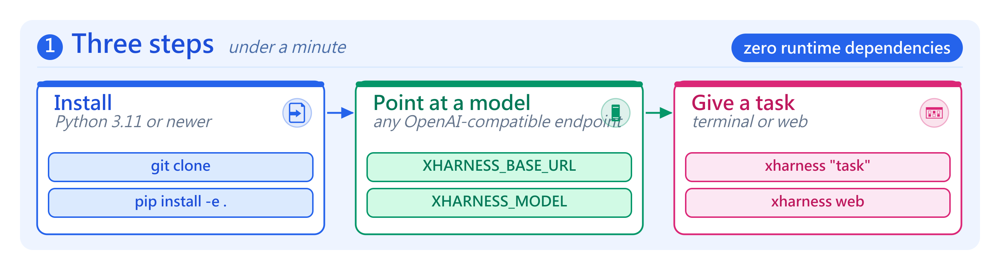
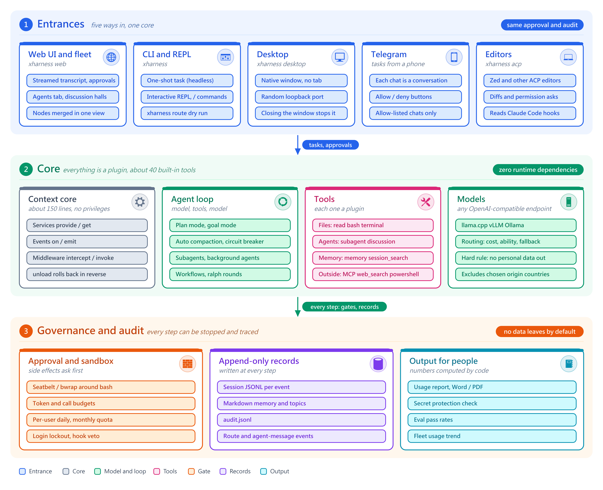
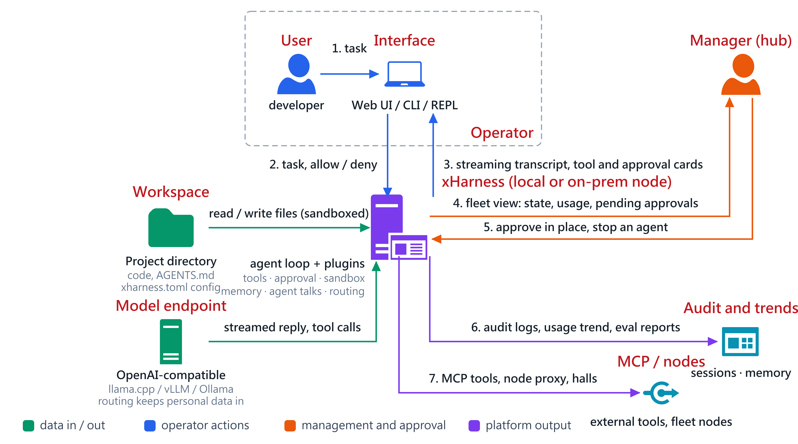
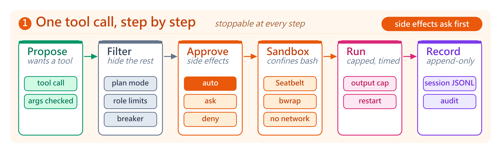
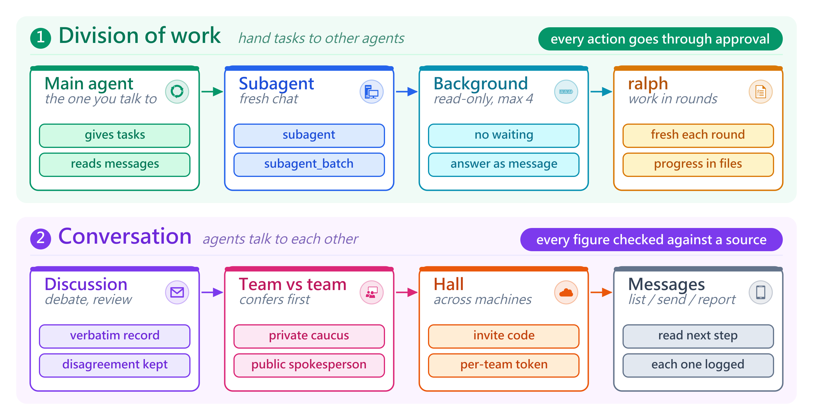
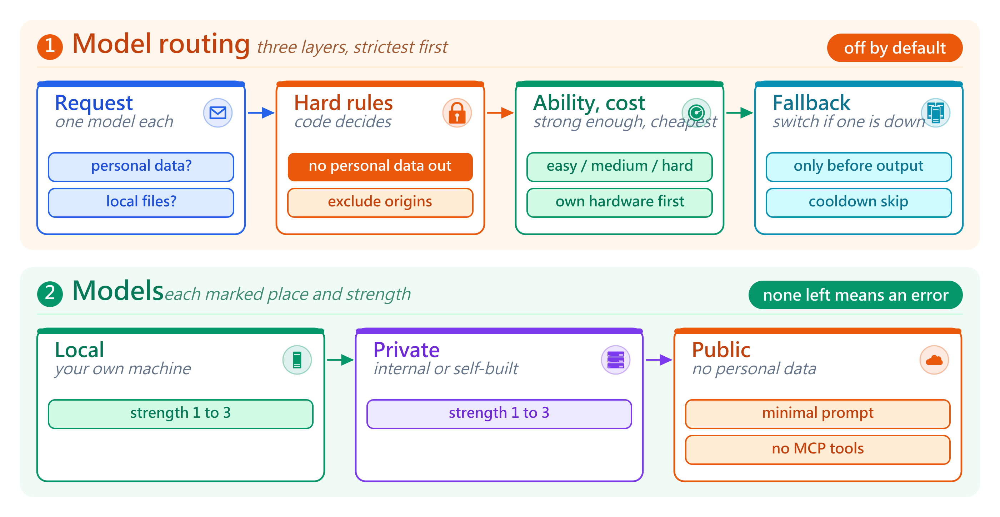
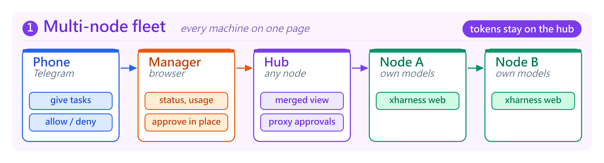
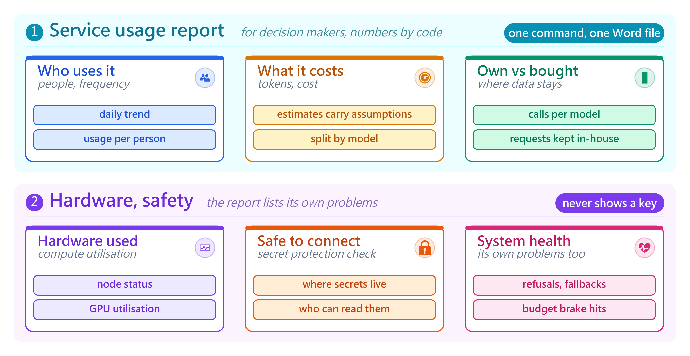

# xHarness

[中文](README.md) | English

[](https://github.com/guessleej/xHarness/actions/workflows/ci.yml)
[](LICENSE)
[](pyproject.toml)

A plugin-based AI agent harness by xCloudinfo: **governance first, zero runtime dependencies**, any OpenAI-compatible endpoint, your data stays in your own room. About 17,500 lines of Python and 519 tests.

## Three steps



```sh
git clone https://github.com/guessleej/xHarness.git && cd xHarness
python3 -m venv .venv && ./.venv/bin/pip install -e .
XHARNESS_BASE_URL=http://localhost:8080/v1 XHARNESS_MODEL=your-model ./.venv/bin/xharness web
```

## Architecture



Five entrances share one core and one approval path; the core is a roughly 150-line `Context` and everything else is a plugin; every step can be stopped and traced.

## How people use it



## One tool call



## Multiple agents



## Model routing



## Multi-node fleet



## Service usage report



## Notification channels

When a task finishes, fails or waits for an approval, a message goes to Telegram, LINE or Microsoft Teams. An admin adds them on the web page, Admin > Notification channels, which walks through getting each key; saving checks the key with the service, then stores it AES-256-GCM encrypted (needs `pip install 'xharness[secure]'`).

- **Telegram** works both ways: authorised people give the node tasks from their phone, and approvals for tasks started on the web arrive with Allow and Deny buttons. A newcomer sends the bot one message; the admin presses Authorise on the page.
- **LINE and Teams** only notify. Talking back would need a public HTTPS address, which a node on an internal network does not have. By default they carry the title and a link, not the answer; carrying the answer is a per-channel tick, and the security check page lists the channels that have it.
- Each channel picks its events, and "task finished" can wait for a minimum duration, so a four-second answer does not buzz a phone.

## Resident agent

An agent that stays up on the node (`[superagent] enabled = true`). It listens to a GitHub repository and Telegram groups, hands the work it accepts to workers in isolated directories, and answers in the topic or pull request where it was asked; people are called only for decisions and reviews. The design follows DeepSeek's open Super-agent prototype (MIT) and keeps xHarness's approvals, sandbox and audit.

- **Code decides who may ask**: an allowed person who addresses the agent makes an explicit request. Anything else needs a rule the team wrote, and by default the agent only observes, recording what it would have accepted. An accept freezes its Mandate on the ticket, which message text cannot change.
- **The main Session routes; workers work**, each in its own git worktree. Later messages, CI results and reviews on the same pull request or topic go straight to that ticket's worker.
- **The system opens pull requests**: workers never hold the GitHub token. The team's check runs first; a code change without a pull request cannot be reported ready.
- **Every outside write waits for approval** by default, on the page or Telegram. Chat replies stay under 100 words.
- The "常駐代理" page shows the setup steps, then inbox, tickets, events (where each message went) and settings; a watchdog outside the agents watches for stalled or looping work.

## Built-in tools

| Group | Tools |
|---|---|
| Files and commands | `read` `write` `edit` `glob` `grep` `bash` `terminal` `powershell` `job_*` |
| Agents | `subagent` `subagent_batch` `ralph` `workflow` (all with `isolate` workspaces and a `check` gate) `discussion` `list_agents` `send_message` `report` |
| Task board (`[board]`) | `board_list` `board_add` `board_claim` `board_heartbeat` `board_release` `board_note` `board_notes` |
| Memory and history | `memory_*` `session_search` `session_read` `todo_write` `skill` `schedule_*` |
| Talking to people | `ask_user` `goal_done` |
| Code | `lsp` `security_scan` |
| Once configured | `web_search` `browser_open` `webfetch` `desktop_look` `desktop_act` (use this computer, macOS and Windows, asks every time) and MCP tools |

## More

[Config example (every option, commented)](xharness.example.toml) · [Architecture notes](docs/architecture.md) · [SSDLC](docs/ssdlc.md) · [Security policy](SECURITY.md) · [Changelog](CHANGELOG.md) · MIT licence
